# Slack to Teams: Line of Business App Migration Guide

A step-by-step guide for migrating your organization's custom Slack bots and Line of Business (LOB) applications to Microsoft Teams — or extending them to run on both platforms simultaneously.

> **Data migration vs. app migration:** This guide focuses on migrating your **custom-built apps and bots**. For migrating your organization's **data** (channels, messages, files, users), see Microsoft's official guide: [Migrate from Slack to Microsoft Teams](https://learn.microsoft.com/en-us/microsoftteams/migrate-slack-to-teams).

---

## Table of Contents

1. [Migration Overview](#migration-overview)
2. [Phase 1: Plan Your Migration](#phase-1-plan-your-migration)
3. [Phase 2: Set Up Your Environment](#phase-2-set-up-your-environment)
4. [Phase 3: Bootstrap the Expert System](#phase-3-bootstrap-the-expert-system)
5. [Phase 4: Execute the Migration Plan](#phase-4-execute-the-migration-plan)
6. [Phase 5: Review the Migrated Code](#phase-5-review-the-migrated-code)
7. [Phase 6: Test and Deploy](#phase-6-test-and-deploy)
8. [Phase 7: Data Migration (Channels, Messages, Files)](#phase-7-data-migration-channels-messages-files)
12. [Post-Migration: Maintaining and Extending Your App](#post-migration-maintaining-and-extending-your-app)

---

## Migration Overview

Most organizations have invested significantly in custom Slack bots that automate workflows, surface data from internal systems, and integrate with Line of Business tools. Migrating these apps to Teams doesn't mean starting over — the `slack-plus-teams` expert system guides AI coding agents through every bridging decision, turning weeks of trial-and-error into a structured, repeatable process.

### What This Guide Covers

| Concern | Approach |
|---------|----------|
| **Custom bots & integrations** | Extend your Slack bot to also run on Teams (dual-platform) |
| **Slash commands** | Bridge to Teams text commands or message extensions |
| **Block Kit UI** | Convert to Adaptive Cards |
| **Modals & interactive flows** | Bridge to Task Modules / Dialogs |
| **OAuth & identity** | Map Slack OAuth to Azure AD / Microsoft SSO |
| **Infrastructure** | Bridge AWS services to Azure equivalents (or run both) |
| **Webhooks & connectors** | Migrate incoming webhooks to Teams connectors or bot endpoints |
| **Channel data & history** | Reference to Microsoft's official data migration tools |

### Migration Strategies

You have three options depending on your timeline and requirements:

1. **Dual-platform (recommended)** — Keep your Slack bot running while adding Teams support. Both platforms share a common service layer. Migrate users gradually.
2. **Full migration** — Rewrite the Slack bot as a Teams-only app. Simpler end state but higher risk and no fallback.
3. **Parallel operation** — Run independent Slack and Teams bots with shared backend services. Lower coupling but duplicated logic.

> **This guide follows the dual-platform approach**, which is recommended for LOB apps because it minimizes disruption and allows phased rollout.

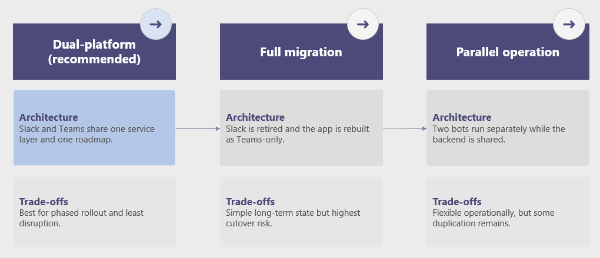

---

## Phase 1: Plan Your Migration

Before writing any code, assess what you have and what needs to move.

### 1.1 Inventory Your Slack Apps

List every custom bot, integration, and workflow in your Slack workspace:

1. Go to `<your-workspace>.slack.com/apps/manage` to see all installed apps
2. Identify which are **custom-built** (your LOB apps) vs. **third-party** (marketplace apps)
3. For each custom app, document:
   - What it does (commands, event handlers, scheduled jobs)
   - Which channels it operates in
   - What external systems it connects to
   - How many users depend on it

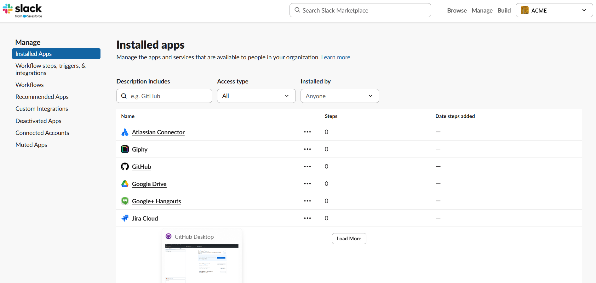

### 1.2 Categorize by Complexity

Use the difficulty ratings from [feature-gaps.md](feature-gaps.md) to categorize each feature your app uses:

| Rating | Meaning | Examples |
|--------|---------|----------|
| **GREEN** | Direct mapping exists — straightforward conversion | Messages, basic commands, simple cards |
| **YELLOW** | Requires design decisions — mapping exists but behavior differs | Ephemeral messages, file uploads, thread broadcasting |
| **RED** | Gap — no direct equivalent, requires redesign | Mid-form modal updates, emoji reactions as input, workflow steps |

### 1.3 Prioritize Migration Order

For organizations with multiple LOB apps, prioritize based on:

- **Business impact** — Which apps are most critical to daily operations?
- **Complexity** — Start with GREEN-heavy apps to build team confidence
- **User overlap** — Which app's users are migrating to Teams first?
- **Dependencies** — Which apps depend on other apps that need to migrate first?

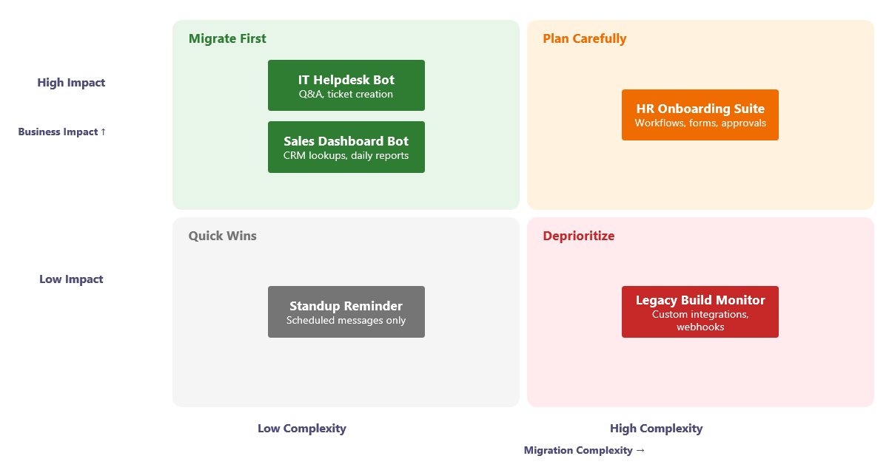

### 1.4 Coordinate with Data Migration

Microsoft provides a complete guide for migrating your organization's Slack data to Teams:

> **[Migrate from Slack to Microsoft Teams](https://learn.microsoft.com/en-us/microsoftteams/migrate-slack-to-teams)**
>
> This covers:
> - Exporting channels, messages, and files from Slack
> - Mapping Slack users to Microsoft 365 accounts (with PowerShell scripts)
> - Planning team and channel structure in Teams
> - Copying channel history and files
> - User readiness and adoption planning

**Coordinate your app migration timeline with data migration.** Your LOB apps should be ready on Teams before (or at the same time as) users are migrated, so they don't lose access to critical workflows.

---

## Phase 2: Set Up Your Environment

### 2.1 Prerequisites

| Requirement | Details |
|-------------|---------|
| **Node.js** | v18+ (LTS recommended) |
| **TypeScript** | v5+ |
| **Slack app** | Your existing Slack bot with API credentials |
| **Azure account** | For Teams bot registration and deployment |
| **Microsoft 365 developer tenant** | For testing ([free dev program](https://developer.microsoft.com/microsoft-365/dev-program)) |
| **Microsoft 365 Agents Toolkit** | [VS Code extension or CLI](https://learn.microsoft.com/en-us/microsoftteams/platform/toolkit/overview-agents-toolkit) for Teams app scaffolding |
| **AI coding agent** | Claude Code, GitHub Copilot, or Cursor |

### 2.2 Register a Teams Bot

1. Go to the [Azure Portal](https://portal.azure.com) → **Create a resource** → **Azure Bot**
2. Configure the bot with a unique handle and your Azure subscription
3. Under **Configuration**, note your **Microsoft App ID** and generate a **Client Secret**
4. Set the messaging endpoint to your app's URL (e.g., `https://your-app.azurewebsites.net/api/messages`) or a [Dev Tunnel](https://learn.microsoft.com/en-us/azure/developer/dev-tunnels/get-started) for local testing (e.g., `https://your-tunnel.devtunnels.ms/api/messages)
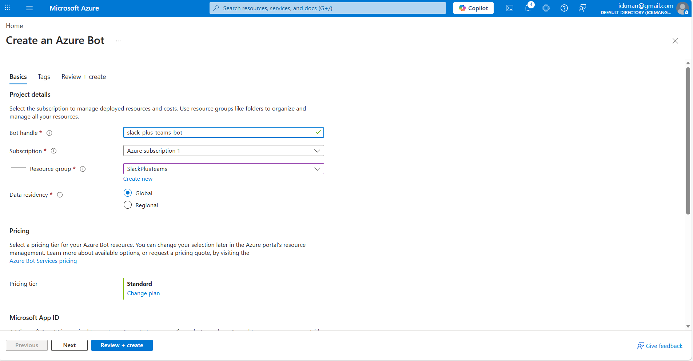

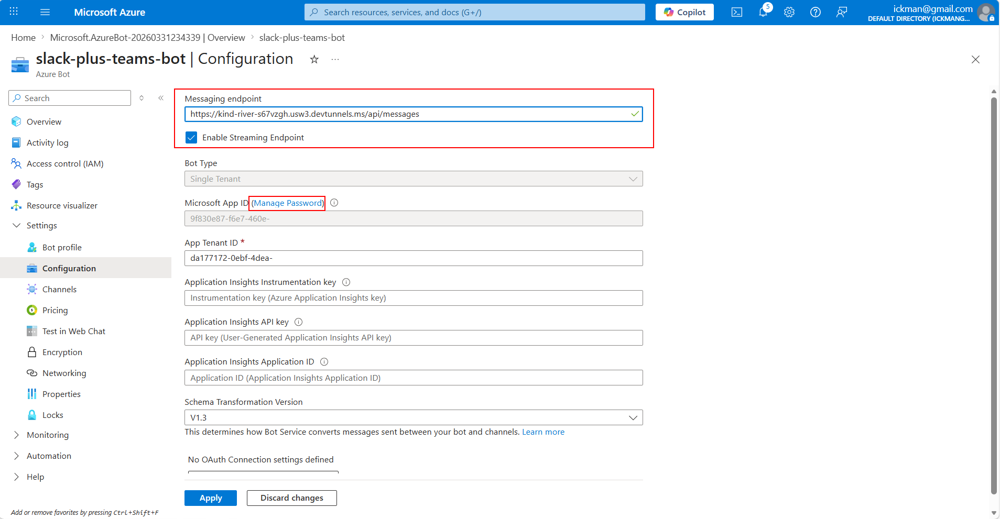

### 2.3 Enable Teams Channel

1. In the Azure Bot resource, go to **Channels**
2. Click **Microsoft Teams** to enable the Teams channel
3. Accept the Terms of Service

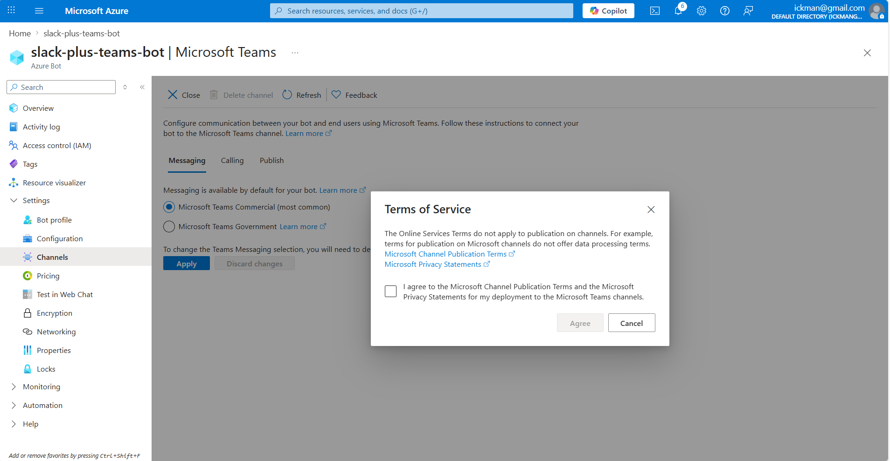

### 2.4 Scaffold a Teams App with Manifest

Use Microsoft 365 Agents Toolkit to create a scaffolded Agent:

```bash
# Using Agents Toolkit CLI (install: npm install -g @microsoft/m365agentstoolkit-cli)
atk new -c basic-custom-engine-agent -l typescript -n slack-plus-teams-bot -i false
```

Your manifest defines your app's identity, permissions, and capabilities in Teams.

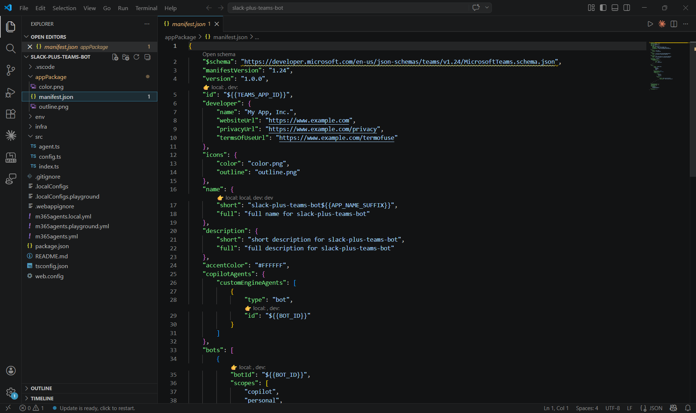

---

## Phase 3: Bootstrap the Expert System

The `slack-plus-teams` expert system is a collection of 116 micro-expert files that guide AI agents through every aspect of cross-platform bot development. Here's how to set it up.

### 3.1 Clone the Repository

Clone the `slack-plus-teams` repository from GitHub:

```bash
git clone https://github.com/microsoft/slack-plus-teams.git
```

### 3.2 Start the Onboarding Flow

Open your AI coding agent (Claude Code, GitHub Copilot, Cursor, etc.) from your Slack bot's project directory and reference the onboarding playbook:

```
Read ../slack-plus-teams/ONBOARD.md and follow the instructions. I have an existing Slack bot that I want to add Teams support to.
```

The agent will walk you through the following steps interactively:

1. **Ask for your project path** — The agent asks where your existing Slack bot lives. Provide the path (e.g., `..\bolt-js-assistant-template` or an absolute path).
2. **Bootstrap the expert system** — The agent copies the `experts/` directory from the cloned repo into your project automatically.
3. **Analyze your codebase** — The agent scans your project in parallel to detect your language, platform, features, and architecture.
4. **Present analysis results** — You'll see a summary table showing what the agent found (language, platform, framework, hosting, features, etc.).
5. **Ask for your migration strategy** — The agent presents the three migration strategies (Dual-platform, Full migration, Parallel operation) and waits for your choice.
6. **Identify missing experts** — The agent compares your tech stack against the expert system to find any gaps (see [Identifying and Building Missing Experts](#identifying-and-building-missing-experts) below).
7. **Build missing experts** — Based on the gap analysis, the agent can create new experts for technologies not yet covered.
8. **Run the cross-platform advisor** — The agent loads the bridging advisor, builds a feature inventory of your codebase, and walks you through design decisions for any YELLOW-rated features (e.g., ephemeral messages, transport mode). You can accept the recommended defaults or choose alternatives.
9. **Generate a migration plan** — The agent produces a `PLAN.md` file with your complete migration roadmap, including phased implementation steps and expert references for each task.

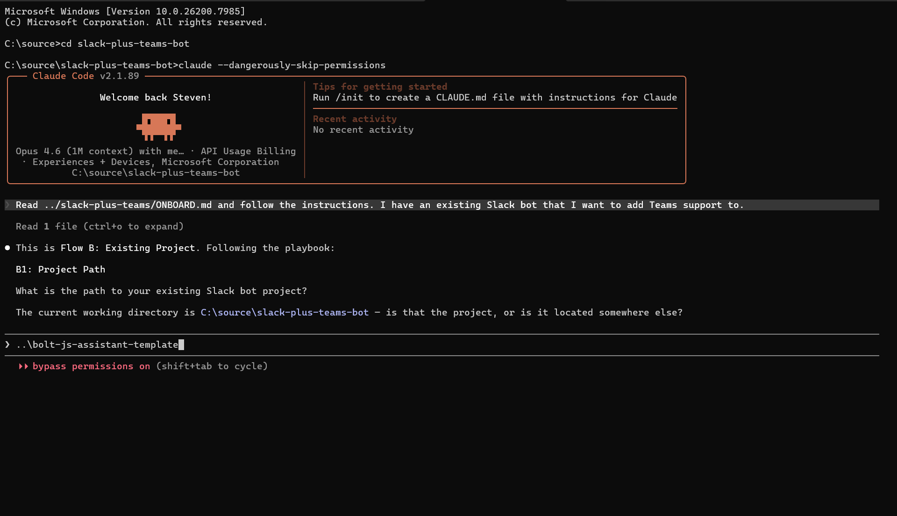
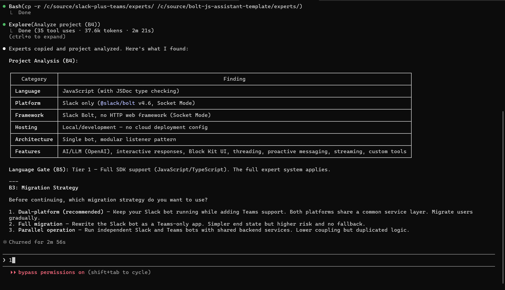

#### Identifying and Building Missing Experts

After you choose your migration strategy, the agent compares your project's tech stack against the expert system to identify any technologies that aren't yet covered. If it finds gaps, it offers to build new expert files for you:

1. **All high priority** — Automatically create experts for the most important gaps.
2. **Let me pick** — Review the list and choose which experts to create.
3. **Skip** — Proceed with the existing experts as-is.

Built experts are saved to the appropriate domain folder (e.g., `experts/models/` or `experts/slack/`) in the same format as the existing experts. You can always build additional experts later by asking your AI agent to create one for a specific technology.

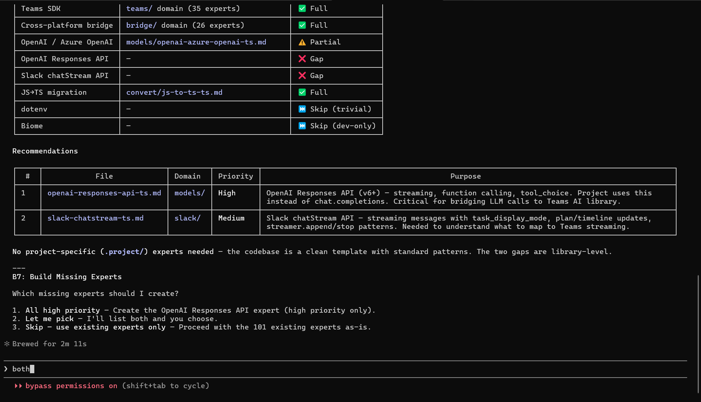

### 3.3 Cross-Platform Architecture

After the advisor walkthrough, the agent loads the cross-platform architecture expert (`experts/bridge/cross-platform-architecture-ts.md`) to design your dual-platform bot structure. Based on your codebase analysis and migration strategy, it determines:

- **Entry point pattern** — How Slack (Socket Mode) and Teams (HTTPS) adapters coexist in the same process
- **Shared service layer** — Which business logic to extract so both platforms share it
- **Adapter boundaries** — What stays platform-specific vs. what becomes shared
- **Transport setup** — How to run both WebSocket (Slack) and HTTP (Teams) receivers

The agent uses this architecture to inform the migration plan it generates next.

### 3.4 Review the Generated Plan

The agent produces a `PLAN.md` file that lists:
- Every feature to bridge, with difficulty ratings
- The recommended migration order
- Which expert files to consult for each feature
- Architecture decisions (dual-bot, single-server, etc.)

Review and approve this plan before proceeding.

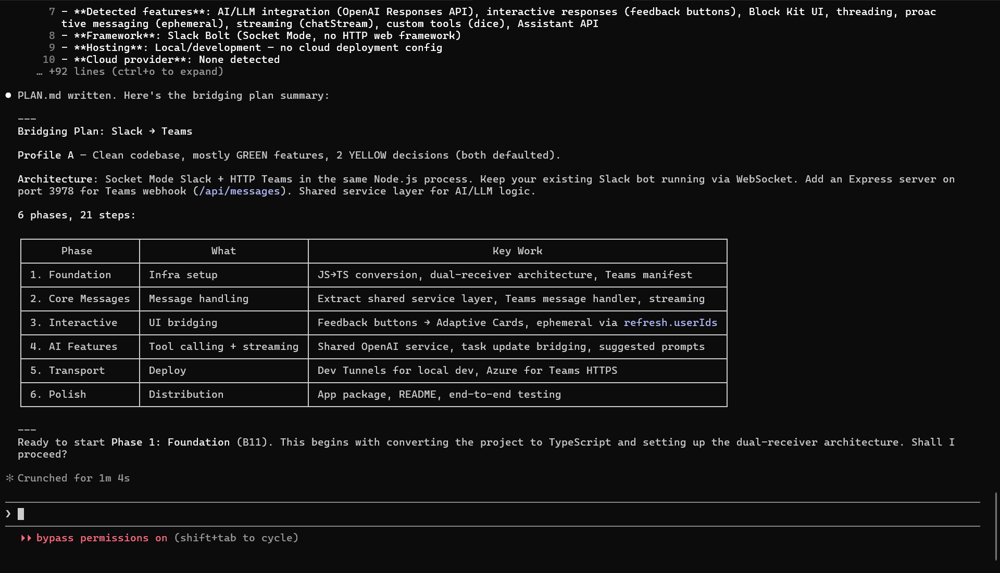

---

## Phase 4: Execute the Migration Plan

With the `PLAN.md` approved, tell your AI coding agent to start executing it. The agent works through each phase of the plan autonomously, consulting the expert system for platform-specific patterns and making architecture decisions based on the cross-platform advisor's earlier analysis.

```
Execute the migration plan in PLAN.md. Start with Phase 1.
```

The agent does all the coding work — extracting shared services, creating adapters, bridging UI, wiring up auth. **Your role is to review the code it produces, test on both platforms, and provide feedback.** The sections below describe what the agent builds at each stage so you know what to look for during review.

### 4.1 Architecture: Adapter Pattern

The agent sets up a **shared service layer** with platform-specific adapters. The typical project structure it creates looks like:

```
your-app/
├── src/
│   ├── adapters/
│   │   ├── slack-bot.ts      # Slack Bolt adapter
│   │   └── teams-bot.ts      # Teams AI SDK adapter
│   ├── services/
│   │   ├── message-handler.ts  # Shared business logic
│   │   ├── command-registry.ts # Shared command handling
│   │   └── action-handler.ts   # Shared interactive responses
│   ├── ui/
│   │   ├── blocks.ts          # Block Kit builders
│   │   ├── cards.ts           # Adaptive Card builders
│   │   └── convert.ts         # Block Kit ↔ Adaptive Card conversion
│   ├── identity/
│   │   └── user-map.ts        # Cross-platform user identity mapping
│   └── index.ts               # Entry point — starts both adapters
├── experts/                    # Expert system (copied in Phase 3)
├── .env                        # Platform credentials
└── package.json
```

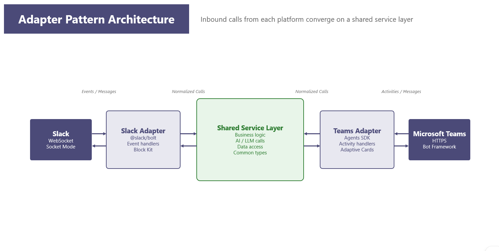

### 4.2 Key Dependencies

The agent adds the required Teams dependencies alongside your existing Slack packages:

```json
{
  "dependencies": {
    "@slack/bolt": "^4.0.0",
    "@microsoft/teams-ai": "^2.0.0",
    "botbuilder": "^4.23.0"
  }
}
```

### 4.3 Entry Point Pattern

The agent creates a single entry point that starts both platform adapters:

```typescript
// src/index.ts
import { slackApp } from './adapters/slack-bot';
import { teamsApp } from './adapters/teams-bot';

// Start Slack (Socket Mode)
slackApp.start();
console.log('Slack bot running (Socket Mode)');

// Start Teams (HTTP on port 3978)
teamsApp.listen(3978);
console.log('Teams bot running on :3978');
```

> See the working example at `examples/slack-add-teams/` for a complete reference implementation.

---

## Phase 5: Review the Migrated Code

As the agent works through `PLAN.md`, review what it produces at each step. The agent tackles features in order of difficulty — GREEN first, then YELLOW, then RED — extracting business logic into the shared service layer and creating platform-specific adapters. Here's what to expect and what to look for.

### 5.1 Core Messaging and Commands

The agent bridges your bot's message handling and commands between the two platforms:

| Slack Pattern | Teams Equivalent | Difficulty |
|---------------|------------------|------------|
| `app.message()` handlers | `app.on('message')` activity handlers | GREEN |
| Slash commands (`/status`) | Text command detection or message extensions | GREEN |
| Button clicks / menu selections | Adaptive Card `Action.Submit` handlers | GREEN |
| Threaded replies (`thread_ts`) | Reply-to-activity chains | GREEN |
| Ephemeral messages (`postEphemeral`) | `refresh.userIds` per-user cards or 1:1 chat | YELLOW |
| Proactive messages | Conversation reference + `continueConversation` | YELLOW |

For each feature, the agent creates a shared service function (business logic) and two thin adapters (one for Slack, one for Teams) that call into it.

> **Expert references:** `experts/bridge/events-activities-ts.md`, `experts/bridge/commands-slash-text-ts.md`, `experts/bridge/interactive-responses-ts.md`

### 5.2 UI Components

The agent converts your Slack Block Kit layouts to Adaptive Cards for Teams. This is the most visible part of the migration — review the generated cards carefully.

| Block Kit Element | Adaptive Card Equivalent | Difficulty |
|-------------------|-------------------------|------------|
| `section` with text | `TextBlock` | GREEN |
| `actions` with buttons | `ActionSet` with `Action.Submit` | GREEN |
| `input` block | `Input.Text` | GREEN |
| `image` / `context` / `divider` | `Image` / subtle `TextBlock` / separator | GREEN |
| Modals (`views.open`) | Task Modules / Dialogs | GREEN–YELLOW |
| Push new modal view | Multi-step dialog (sequential) | YELLOW |
| Mid-form modal updates | Close + reopen with new content | YELLOW |
| Field validation errors in modal | Custom validation before submit | RED |

> **Expert references:** `experts/bridge/ui-block-kit-adaptive-cards-ts.md`, `experts/bridge/ui-modals-dialogs-ts.md`

### 5.3 Identity and Auth

The agent sets up the identity bridging layer so your bot can resolve users across both platforms:

| Slack | Teams |
|-------|-------|
| Slack User ID (`U0123ABC`) | Azure AD Object ID (GUID) |
| OAuth 2.0 with Slack as provider | Azure AD / Microsoft SSO |
| `SLACK_CLIENT_ID` + `SLACK_CLIENT_SECRET` | `CLIENT_ID` + `CLIENT_SECRET` + `TENANT_ID` |
| `users.info` API | Microsoft Graph API |

The agent generates a user mapping service that associates Slack User IDs with Azure AD Object IDs. For bulk mapping, Microsoft's data migration guide includes a [PowerShell script](https://learn.microsoft.com/en-us/microsoftteams/migrate-slack-to-teams#users) for matching Slack email addresses to Microsoft Entra ID accounts.

> **Expert reference:** `experts/bridge/identity-oauth-bridge-ts.md`

### 5.4 Infrastructure (Optional)

If your Slack bot runs on AWS, the agent can bridge infrastructure to Azure. This is optional — the dual-platform approach doesn't require moving off AWS.

| AWS Service | Azure Equivalent | Expert |
|-------------|-----------------|--------|
| Lambda | Azure Functions | `bridge/infra-compute-ts.md` |
| S3 | Azure Blob Storage | `bridge/infra-storage-ts.md` |
| DynamoDB | Cosmos DB | `bridge/infra-storage-ts.md` |
| Secrets Manager | Azure Key Vault | `bridge/infra-secrets-config-ts.md` |
| CloudWatch | Application Insights | `bridge/infra-observability-ts.md` |

The agent also configures **dual transport** — Socket Mode (WebSocket) for Slack alongside an HTTPS endpoint on port 3978 for Teams.

> **Expert reference:** `experts/bridge/transport-socketmode-https-ts.md`

---

## Phase 6: Test and Deploy

### 6.1 Local Testing

1. **Slack:** Test via Socket Mode (no tunnel needed)
2. **Teams:** Use Agents Toolkit dev tunnel (`atk preview`) or ngrok for the HTTPS endpoint
3. **Sideload** your Teams app in a test tenant

![SCREENSHOT PLACEHOLDER: Teams client showing a sideloaded bot app in the left sidebar. The chat window shows a test conversation with the bot responding to a command.]

### 6.2 Test Matrix

Verify every migrated feature on both platforms:

| Feature | Slack | Teams | Notes |
|---------|:-----:|:-----:|-------|
| Basic messages | [ ] | [ ] | |
| Commands | [ ] | [ ] | Slash vs. text |
| Cards / UI | [ ] | [ ] | Block Kit vs. Adaptive Cards |
| Modals / Dialogs | [ ] | [ ] | |
| File upload | [ ] | [ ] | |
| Auth flow | [ ] | [ ] | |
| Error handling | [ ] | [ ] | |

### 6.3 Deploy

For the dual-platform bot, deploy to a service that can run both adapters:

| Option | Best For |
|--------|----------|
| **Azure App Service** | Full control, always-on, easy scaling |
| **Azure Container Apps** | Containerized workloads |
| **Azure Functions** | Event-driven, cost-optimized |
| **AWS Lambda + Azure Functions** | Keep Slack on AWS, add Teams on Azure |

> **Expert reference:** `experts/deploy/azure-bot-deploy-ts.md`, `experts/deploy/aws-bot-deploy-ts.md`

![SCREENSHOT PLACEHOLDER: Azure Portal showing a deployed App Service running the dual-platform bot. The Overview page shows the app is running, with the URL endpoint visible.]

### 6.4 Publish to Your Organization

1. Upload your Teams app package to the **Teams Admin Center**
2. Approve the app for your organization
3. Optionally pin the app in the Teams app bar for all users

![SCREENSHOT PLACEHOLDER: Teams Admin Center "Manage apps" page showing the custom LOB app uploaded and approved, with the "Publish" status visible.]

---

## Phase 7: Data Migration (Channels, Messages, Files)

App migration and data migration are complementary efforts. While this guide focuses on apps, here's how data migration fits into the overall plan.

### Microsoft's Official Data Migration Guide

Follow [Migrate from Slack to Microsoft Teams](https://learn.microsoft.com/en-us/microsoftteams/migrate-slack-to-teams) for the complete data migration process:

1. **Plan your migration**
   - Determine what can be exported based on your Slack plan
   - Assess workspace usage and scope
   - Map Slack users to Microsoft 365 accounts

2. **Export from Slack**
   - Public channel history and files (all plans)
   - Private channels and DMs (paid plans, may require DocuSign request)
   - Use Slack's export tools: `https://get.slack.help/hc/articles/204897248`

3. **Plan your Teams structure**
   - Map Slack workspaces → Teams teams
   - Map Slack channels → Teams channels
   - Use the mapping table:

     | Slack Structure | Teams Structure |
     |-----------------|-----------------|
     | 1 small workspace | 1 team |
     | 1 large workspace | Multiple teams |
     | Multiple workspaces | Multiple teams (grouped logically) |

4. **Import to Teams**
   - Copy exported files to Teams channel document libraries
   - Use tools like [ArgyleMigrator](https://github.com/rbrynteson/ArgyleMigrator) for channel history
   - Set up Microsoft 365 Connectors to replace Slack webhooks

5. **Roll out to users**
   - License users for Teams
   - Add users to the appropriate teams
   - Remove Slack access on a coordinated schedule
   - Provide training using [Microsoft's Teams adoption resources](https://adoption.microsoft.com/microsoft-teams/)

### Coordination Timeline

| Week | App Migration | Data Migration |
|------|--------------|----------------|
| 1-2 | Inventory & planning | Export Slack data, map users |
| 3-4 | Bootstrap expert system, architect | Plan Teams structure |
| 5-8 | Migrate core features, UI, auth | Import history, set up channels |
| 9-10 | Testing & deployment | Sideload apps, user testing |
| 11-12 | Publish to org | License users, cutover |

---

## Post-Migration: Maintaining and Extending Your App

Migration isn't the end — it's the beginning of building on a dual-platform (or Teams-native) foundation. The `slack-plus-teams` expert system continues to add value long after the initial migration.

### Ongoing Development with the Expert System

The expert system isn't just for migration — it's a permanent knowledge base for your AI coding agent. Keep the `experts/` directory in your project for ongoing development.

#### Adding New Features

When you need to add a new feature to your dual-platform bot:

1. **Describe the feature** to your AI agent in natural language
2. The agent **routes to the correct expert(s)** via `experts/index.md`
3. The expert provides **platform-specific patterns** for both Slack and Teams
4. The agent implements the feature using the **shared service layer** pattern

```
Example prompt:
"Add a /ticket command that creates a Jira ticket and posts a confirmation
card with a link to the ticket. It should work on both Slack and Teams."
```

The agent will:
- Consult `experts/bridge/commands-slash-text-ts.md` for command bridging
- Consult `experts/bridge/ui-block-kit-adaptive-cards-ts.md` for the confirmation card
- Implement the shared service logic once, with platform-specific adapters

![SCREENSHOT PLACEHOLDER: AI coding agent (Claude Code) terminal showing the agent routing a new feature request through the expert system — displaying which experts it's consulting and the implementation plan it generated.]

#### Keeping Up with Platform Changes

Both Slack and Teams regularly release new APIs and features. The expert system helps you adopt them:

- **New Teams AI SDK features** → Consult `experts/teams/` domain experts
- **New Slack Bolt features** → Consult `experts/slack/` domain experts
- **New bridging patterns** → Consult `experts/bridge/` domain experts
- **AI model integration** → Consult `experts/models/` for OpenAI, Anthropic, Bedrock, etc.

#### Updating the Expert System

Pull the latest expert files periodically to get updated patterns:

```bash
# Update experts from the slack-plus-teams repo
cd ./slack-plus-teams && git pull && cd ..
cp -r ./slack-plus-teams/experts/ ./experts/
```

### Maintaining Your Dual-Platform App

#### Shared Service Layer Benefits

Because your business logic lives in the shared service layer, maintenance is simplified:

| Change | Where to Edit | Platforms Affected |
|--------|--------------|-------------------|
| Business logic update | `services/` | Both (automatic) |
| New Slack-only feature | `adapters/slack-bot.ts` | Slack only |
| New Teams-only feature | `adapters/teams-bot.ts` | Teams only |
| UI update (both) | `ui/blocks.ts` + `ui/cards.ts` | Both |
| New shared command | `services/command-registry.ts` | Both (automatic) |

#### Monitoring Both Platforms

Set up observability for both platform adapters:

- **Slack:** Monitor Socket Mode connection health, API rate limits
- **Teams:** Monitor HTTPS endpoint health, bot framework errors
- **Shared:** Monitor service layer errors, external API latency

> **Expert reference:** `experts/bridge/infra-observability-ts.md`

#### Scaling Your Team's Capabilities

The expert system works with any AI coding agent. As your team grows:

- New developers can use the onboarding flow (ONBOARD.md) to get productive immediately
- The expert system provides consistent, vetted patterns regardless of which AI agent is used
- Platform comparison docs in `docs/` give human developers quick reference for bridging decisions

### Eventually Sunsetting Slack

If your organization fully migrates to Teams, you can:

1. **Remove the Slack adapter** (`adapters/slack-bot.ts`) and Slack dependencies
2. **Keep the shared service layer** — it's platform-agnostic business logic
3. **Simplify the entry point** to start only the Teams adapter
4. **Retain the expert system** — it's still valuable for Teams-specific development

The adapter pattern makes this a clean, low-risk operation.

---

## Quick Reference: Expert System Domains

| Domain | Expert Count | Use For |
|--------|-------------|---------|
| `experts/bridge/` | 27 | Cross-platform bridging (the core of migration) |
| `experts/teams/` | 36 | Teams-specific features and patterns |
| `experts/slack/` | 19 | Slack-specific features and patterns |
| `experts/convert/` | 9 | Language conversion (JS/Ruby/Java/Kotlin → TypeScript) |
| `experts/models/` | 8 | AI model provider integration |
| `experts/deploy/` | 5 | Cloud deployment (Azure + AWS) |
| `experts/security/` | 3 | Input validation and secrets management |

## Quick Reference: Key Expert Files for Migration

| Migration Task | Expert File |
|----------------|-------------|
| Overall migration strategy | `bridge/cross-platform-advisor-ts.md` |
| Architecture decisions | `bridge/cross-platform-architecture-ts.md` |
| Block Kit → Adaptive Cards | `bridge/ui-block-kit-adaptive-cards-ts.md` |
| Slash commands → text commands | `bridge/commands-slash-text-ts.md` |
| Events → Activities | `bridge/events-activities-ts.md` |
| Modals → Task Modules | `bridge/ui-modals-dialogs-ts.md` |
| OAuth → Azure AD | `bridge/identity-oauth-bridge-ts.md` |
| Middleware → Handlers | `bridge/middleware-handlers-ts.md` |
| Socket Mode → HTTPS | `bridge/transport-socketmode-https-ts.md` |
| AWS → Azure infrastructure | `bridge/infra-compute-ts.md` |

---

## Additional Resources

- **Microsoft's data migration guide:** [Migrate from Slack to Microsoft Teams](https://learn.microsoft.com/en-us/microsoftteams/migrate-slack-to-teams)
- **Teams developer documentation:** [Microsoft Teams Platform](https://learn.microsoft.com/en-us/microsoftteams/platform/)
- **Slack Bolt documentation:** [Slack Bolt for JavaScript](https://slack.dev/bolt-js/)
- **Teams AI SDK:** [Teams AI Library](https://learn.microsoft.com/en-us/microsoftteams/platform/bots/how-to/teams-conversational-ai/teams-conversation-ai-overview)
- **Working examples:** See `examples/slack-add-teams/` and `examples/dual-platform-bot/` in this repository
- **Platform differences:** See `docs/feature-gaps.md` for the complete RED/YELLOW gap inventory
